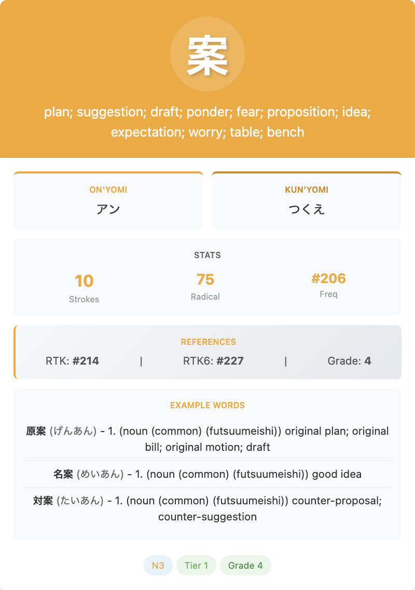

# JLPT Anki Decks

Comprehensive JLPT Anki flashcard decks - **auto-updated monthly** from the latest JMdict dictionary data. Features complete kanji (3,000+) and vocabulary (215,000+) coverage for all JLPT levels (N5-N1) with example sentences, frequency tiers, and multi-language support.

<p align="center"></p>

## 📥 Quick Start

1. Go to [Releases](../../releases) and download the latest release
2. Choose the decks you need (you don't have to download everything):
   - **General decks**: All kanji or vocab for a specific JLPT level
   - **Tiered decks**: Divided into 4 frequency tiers per level
3. Extract the CSV file(s) from the archive
4. Open Anki → File → Import → select the CSV
5. ✅ Check "Allow HTML in fields" (important!)
6. Click Import

That's it! Your deck is ready to study.

## 📦 What's Included

### Kanji Decks

Learn kanji with readings, meanings, stroke counts, and more.

| Level | Kanji | Description |
|-------|-------|-------------|
| N5 | 103 | Beginner level |
| N4 | 181 | Basic level |
| N3 | 579 | Intermediate |
| N2 | 160 | Upper-intermediate |
| N1 | 1,207 | Advanced |

**Each kanji card shows:**
- The kanji character
- Readings (on'yomi and kun'yomi)
- Meanings in English
- Stroke count
- Frequency rank (how common it is)

### Vocabulary Decks

Learn words with example sentences.

| Level | Words | With Examples |
|-------|-------|---------------|
| N5 | ~7,700 | ~1,600 examples |
| N4 | ~15,100 | ~2,900 examples |
| N3 | ~68,500 | ~10,300 examples |
| N2 | ~13,000 | ~2,150 examples |
| N1 | ~65,100 | ~7,700 examples |
| Kana-only | ~40,700 | Words written only in hiragana/katakana |
| Non-JLPT | ~5,100 | Words with kanji outside JLPT scope |

**Each vocabulary card shows:**
- The word (kanji or kana)
- Readings
- English meanings
- Example sentences (when available)
- JLPT level tag

### Tiered Decks (Advanced)

Want to focus on the most common words first? Use tiered decks!

Each JLPT level is split into 4 frequency tiers:
- **Tier 1**: Top 25% most common (start here!)
- **Tier 2**: 25-50% frequency
- **Tier 3**: 50-75% frequency
- **Tier 4**: Bottom 25% least common

This helps you learn the most useful words first within each level.

## 🔄 How Releases Work

New decks are automatically built and released monthly:

1. **Check for updates**: The system checks for new dictionary data from JMdict
2. **Generate decks**: Creates kanji and vocabulary decks for all JLPT levels
3. **Create archives**: Packages everything into easy-to-download files
4. **Publish**: Uploads to GitHub Releases with version numbers

**Version numbers** match the dictionary version (e.g., `3.6.2+20260209125202`), so you know exactly which dictionary data your cards come from.

**Release schedule**: First of every month (or whenever dictionary data updates).

## 🌍 Other Languages

Want decks in your language? The generator supports many languages!

**Available languages** (check the [jmdict-simplified releases](https://github.com/scriptin/jmdict-simplified/releases)):
- Russian (`jmdict-rus`)
- German (`jmdict-deu`)
- French (`jmdict-fra`)
- Spanish (`jmdict-spa`)
- Portuguese (`jmdict-por`)
- Italian (`jmdict-ita`)
- Dutch (`jmdict-dut`)
- And more!

### Generate Decks in Your Language

**Option 1: Download Pre-built (if available)**
Check if someone has already built decks for your language in the releases.

**Option 2: Build Yourself**

1. Install Python 3.7 or higher
2. Download the JSON files for your language from [jmdict-simplified releases](https://github.com/scriptin/jmdict-simplified/releases):
   - `kanjidic2-[lang]-[version].json` (kanji)
   - `jmdict-[lang]-[version].json` (vocabulary)
   - `jmdict-examples-[lang]-[version].json` (examples - optional)
3. Clone this repository
4. Run the generator using the shell scripts:

```bash
# Generate general decks (kanji and vocabulary by JLPT level)
./generate_general_decks.sh

# Generate tiered decks (organized by JLPT level and frequency tier)
./generate_tiered_decks.sh

# Generate with custom output directory
./generate_general_decks.sh -o /path/to/output
./generate_tiered_decks.sh -o /path/to/output

# Generate without example sentences
./generate_general_decks.sh --no-examples
./generate_tiered_decks.sh --no-examples

# Generate tiered decks with only common words
./generate_tiered_decks.sh --common-only

# Generate tiered decks with different tier calculation strategy
./generate_tiered_decks.sh --tier-strategy average
```

The generated CSV files will be in the output folder, ready to import into Anki.

## ⚠️ Troubleshooting

**Import shows weird characters?**
→ Make sure "Allow HTML in fields" is checked when importing

**Missing example sentences?**
→ Only ~17% of words have examples. Common words are more likely to have them.

**Files are too big?**
→ Download only the specific level you need, or use tiered decks to start with common words only.

**Can't find a specific kanji?**
→ It might be in the "non-JLPT" vocab deck if it doesn't have an official JLPT level assigned.

## 📊 How Cards Are Organized

### Kanji Levels
Based on the old JLPT system mapped to new levels:
- Old Level 4 → N5 (easiest)
- Old Level 3 → N4
- Old Level 2 → N3 or N2 (split by grade)
- Old Level 1 → N1 (hardest)

### Vocabulary Levels
Words are assigned to the **highest** JLPT level of any kanji they contain:
- Example: A word with N5 + N1 kanji → N1 deck
- This prevents you from seeing kanji you haven't studied yet
- Kana-only words go in a separate "kana_only" deck

## 📄 License

These decks are derived from:
- **JMdict**: Electronic Dictionary Research and Development Group (EDRDG)
- **Kanjidic2**: Creative Commons Attribution-ShareAlike License v4.0
- **Tatoeba Examples**: Creative Commons CC-BY 2.0 FR

## 🙏 Acknowledgments

- [EDRDG](https://www.edrdg.org/) - Dictionary data
- [Tatoeba Project](https://tatoeba.org/) - Example sentences
- [jmdict-simplified](https://github.com/scriptin/jmdict-simplified) - JSON conversion

---

## 🛠️ Technical Details

For developers and advanced users who want to customize or contribute.

### Project Structure

```
jlpt-anki-generator/
├── scripts/
│   ├── create_kanji_decks.py      # Kanji deck generator
│   ├── create_vocab_decks.py      # Vocabulary deck generator  
│   ├── create_tiered_decks.py     # Tiered/frequency-based decks
│   ├── jmdict_utils.py            # Shared utilities for JMdict processing
│   └── card_templates.py          # HTML/CSS card formatting templates
├── tests/
│   ├── test_create_kanji_decks.py # Unit tests for kanji generation
│   ├── test_create_vocab_decks.py # Unit tests for vocab generation
│   ├── test_create_tiered_decks.py# Unit tests for tiered decks
│   └── test_jmdict_utils.py       # Unit tests for utilities
├── .github/workflows/
│   ├── test.yml                   # CI/CD for testing and linting
│   └── build-and-release.yml      # Automated release workflow
├── generate_general_decks.sh      # Shell wrapper for general decks
├── generate_tiered_decks.sh       # Shell wrapper for tiered decks
├── pytest.ini                     # Test configuration
└── decks/                         # Generated decks (output)
```

### Automated Workflows

#### 1. Test Workflow (`test.yml`)

Runs on every push and pull request:
- **Tests**: Runs pytest across Python 3.10, 3.11, 3.12 with coverage reporting
- **Linting**: Black formatting and Ruff linting checks
- **Coverage**: Uploads to Codecov (currently **99% coverage**)

#### 2. Build and Release Workflow (`build-and-release.yml`)

Complete CI/CD pipeline that:
1. Fetches the latest dictionary release from [jmdict-simplified](https://github.com/scriptin/jmdict-simplified)
2. Downloads and caches JSON files (kanjidic2, JMdict, examples)
3. Generates all deck types using shell scripts
4. **Validates generated CSVs** (verifies file count, example sentences, example words)
5. Creates tar.gz and zip archives for each deck
6. Verifies archive integrity
7. Generates release notes
8. Publishes GitHub release with artifacts

**Triggers:**
- Monthly (1st of each month via cron)
- Manual trigger (workflow_dispatch)
- Push to main/master (when workflow/scripts change)

### Prerequisites for Local Generation

- Python 3.10+ (tested on 3.10, 3.11, 3.12)
- JSON dictionary files from [jmdict-simplified releases](https://github.com/scriptin/jmdict-simplified/releases)

### Running Tests

The project has comprehensive test coverage (99%) with 223 tests:

```bash
# Run all tests with coverage
pytest --cov=scripts --cov-report=term-missing

# Run specific test file
pytest tests/test_jmdict_utils.py -v

# Run with verbose output
pytest -v
```

### Script Options

**General Decks (by JLPT level only):**
```bash
./generate_general_decks.sh -o output_dir/
```

Generates kanji and vocabulary decks organized by JLPT level (N5-N1).

**Tiered Decks (by JLPT level and frequency):**
```bash
./generate_tiered_decks.sh -o output_dir/
```

Generates decks organized by both JLPT level and frequency tier (Tier 1-4).

**Common Options:**
```bash
# Custom output directory
./generate_general_decks.sh -o my_decks/
./generate_tiered_decks.sh -o my_decks/

# Exclude example sentences
./generate_tiered_decks.sh --no-examples

# Only common words (tiered only)
./generate_tiered_decks.sh --common-only

# Tier calculation strategy (tiered only)
./generate_tiered_decks.sh --tier-strategy average  # conservative, average, first
```

### Direct Python Usage

For advanced customization, run Python scripts directly:

```bash
# Kanji decks
python scripts/create_kanji_decks.py \
  --input kanjidic2-en-3.6.2.json \
  --jmdict jmdict-eng-3.6.2.json \
  --max-examples 3 \
  --output-dir my_decks/

# Vocabulary decks  
python scripts/create_vocab_decks.py \
  --jmdict jmdict-eng-3.6.2.json \
  --jmdict-examples jmdict-examples-eng-3.6.2.json \
  --kanjidic kanjidic2-en-3.6.2.json \
  --output-dir my_decks/ \
  --examples \
  --common-only

# Tiered decks
python scripts/create_tiered_decks.py \
  --jmdict jmdict-eng-3.6.2.json \
  --jmdict-examples jmdict-examples-eng-3.6.2.json \
  --kanjidic kanjidic2-en-3.6.2.json \
  --output-dir tiered_decks/ \
  --tier-strategy conservative
```

### Customizing Output

**Card Templates:** The `card_templates.py` module contains HTML/CSS templates for formatting cards. You can modify:
- HTML structure of card fields
- CSS styling for kanji, readings, and examples
- Template patterns for different deck types

**CSS in Anki:** After importing, customize appearance via Anki's card styling:
```css
.card {
  font-family: "Noto Sans JP", sans-serif;
  font-size: 24px;
}
.kanji { color: #333; font-size: 72px; }
.reading { color: #0066cc; }
.meaning { color: #666; }
```

### Contributing

1. Fork the repository
2. Create a feature branch
3. Make changes with tests
4. Ensure tests pass: `pytest`
5. Check formatting: `black scripts/ tests/` and `ruff check scripts/ tests/`
6. Submit a pull request

**Code Quality:**
- 99% test coverage maintained
- Black code formatting enforced
- Ruff linting checks
- Type hints encouraged

Issues and feature requests welcome!
